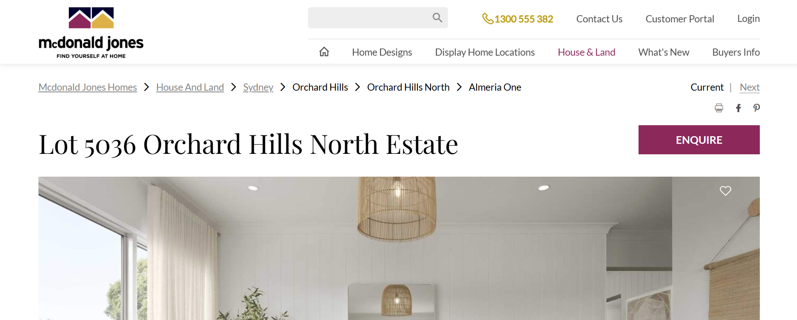
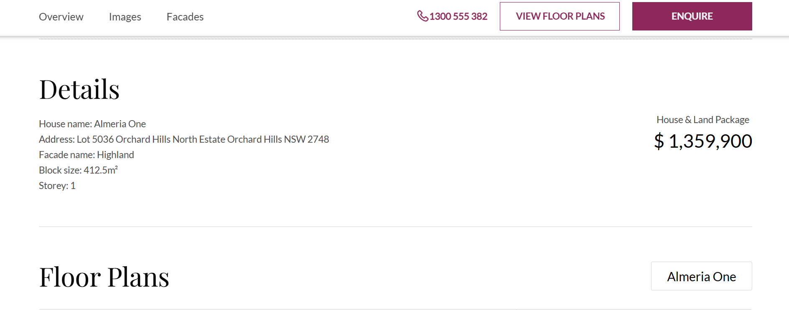
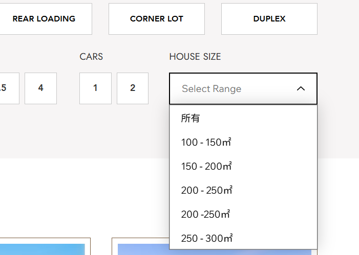
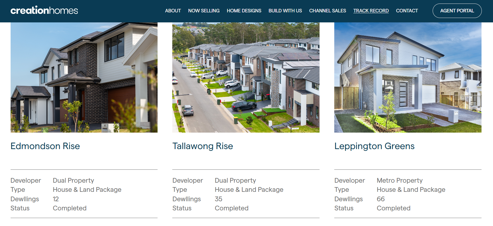
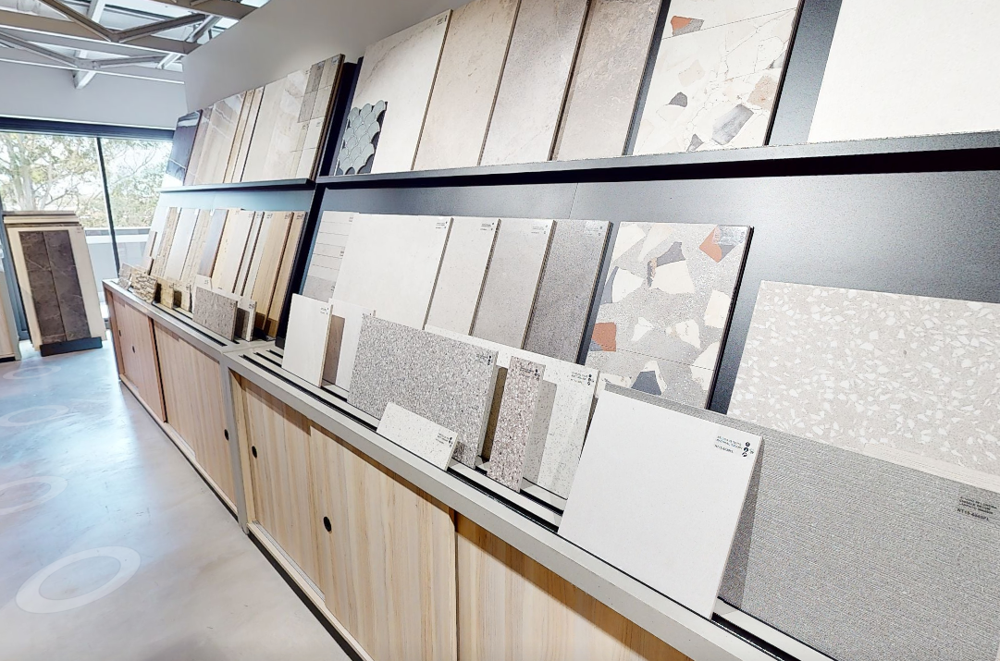
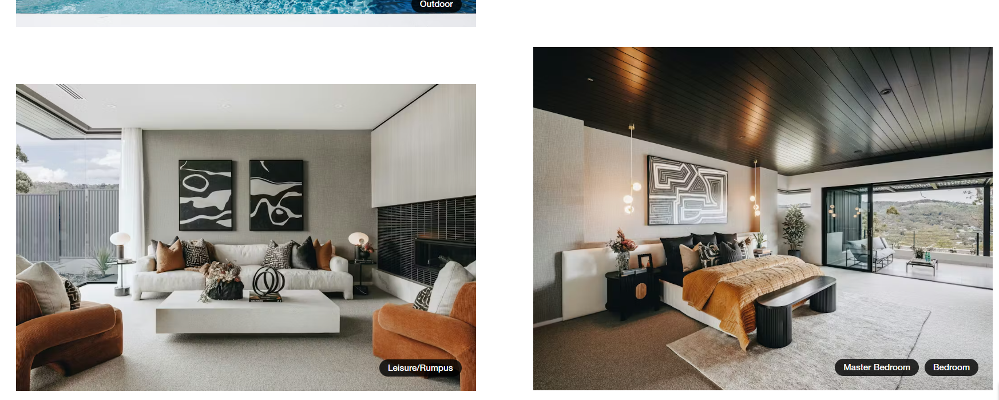

# 网页更改需求

## 1. 添加
* House & Land 界面需要添加地图插件 
  1. 整体悉尼地图标注所有土地位置
  
  2. 单个土地页面内部位置标注
  
* Chat 界面需要定向自动回复
  1. 可以定义简单方向引导客户勾选
  2. 引用外部AI平台导向
  3. 自建公司检索 AI agent
  
## 2. 更改
* 下拉菜单时最上方导览隐藏（移动端不需要更改）

Noble:

Mcdonald jones:

* 输入误处：
  1. Fisrt Floor Living -> First Floor Living

    
  2. 官网中文

    

## 3. 其他建筑公司官网宣传优势

1. eden brae homes
  
    Colour compare:
    通过互动方式更直观展示不同需求展示

    

2. creationhomes:

    Track Record:
    通过展示过往项目经历提高客户认可度
    
    

3. metricon:

    Studio M (实体优势):
    高度满足个性化客户需求，提供studio M展厅允许客户近距离自主选择

    

    Image Gallery:
    线上展示多种内部外部的效果图，满足客户需求

    

